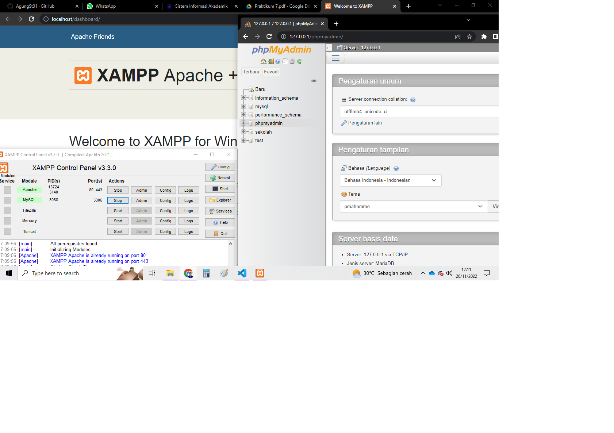
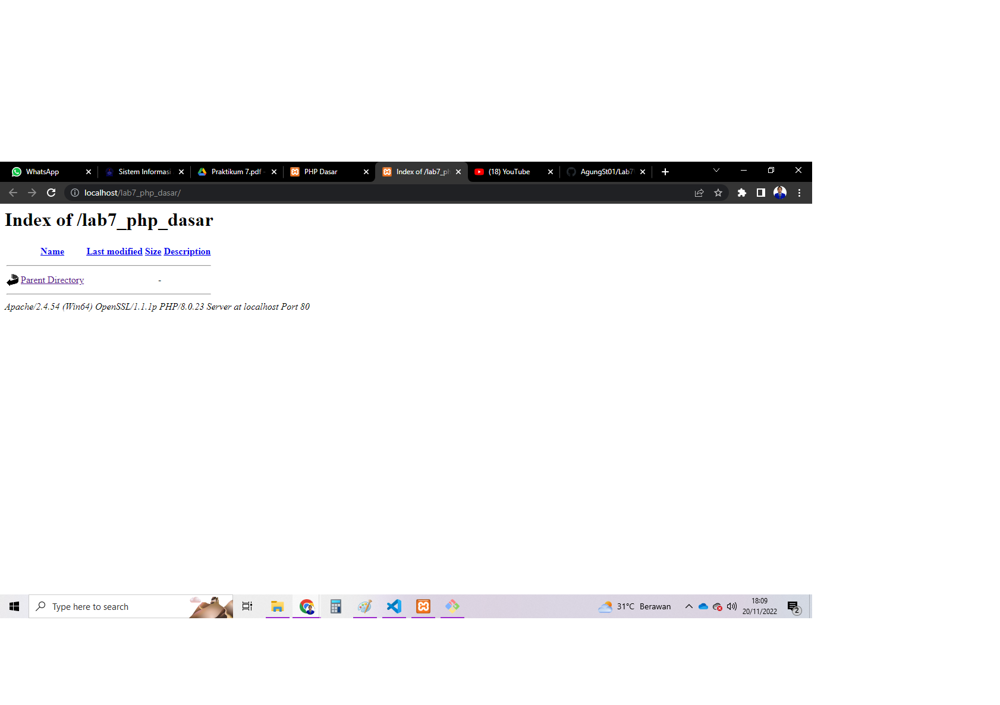
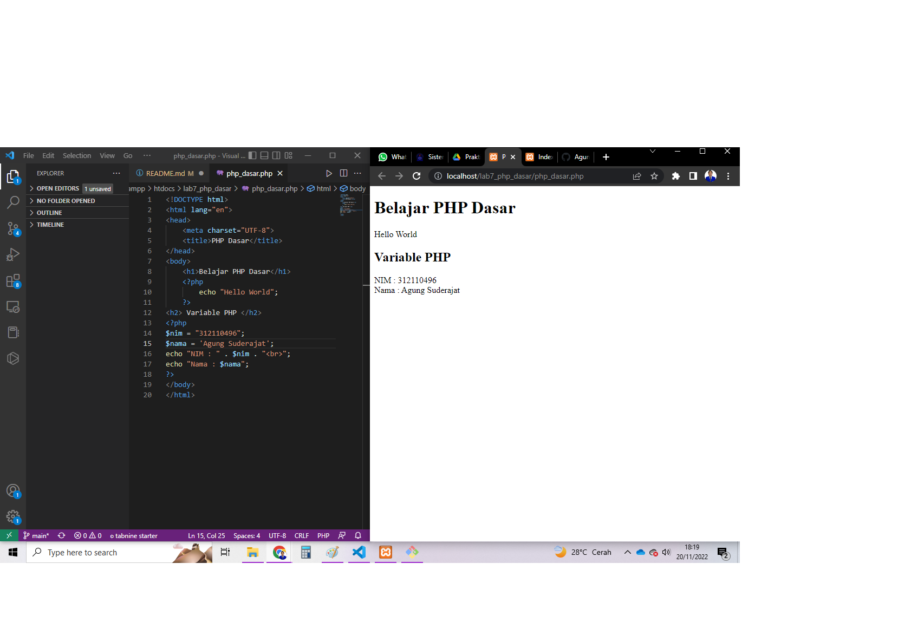
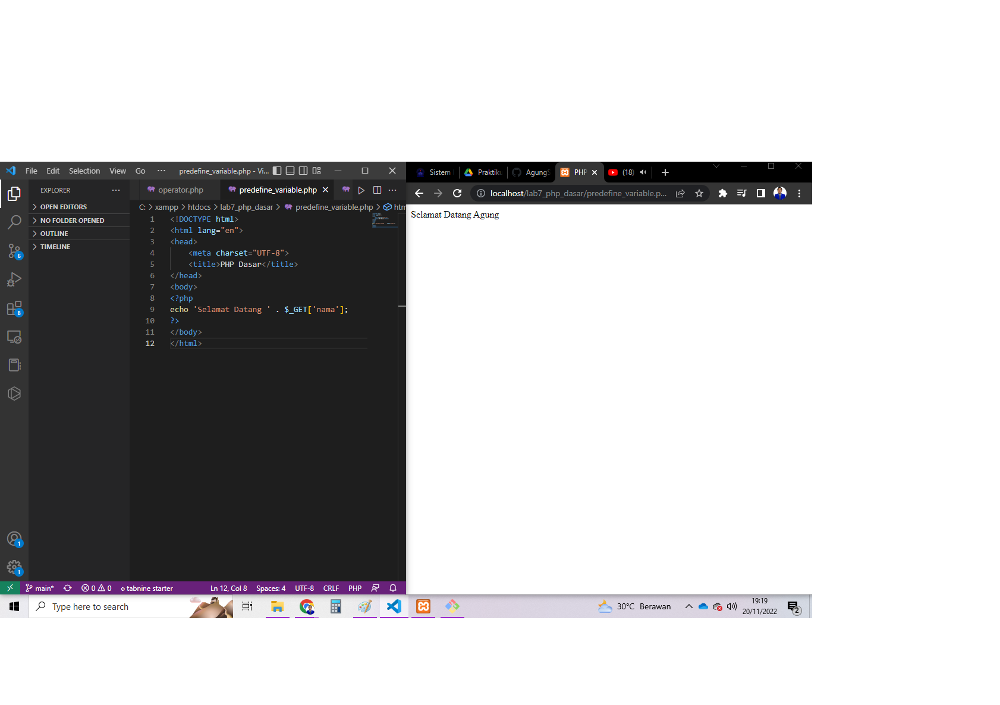
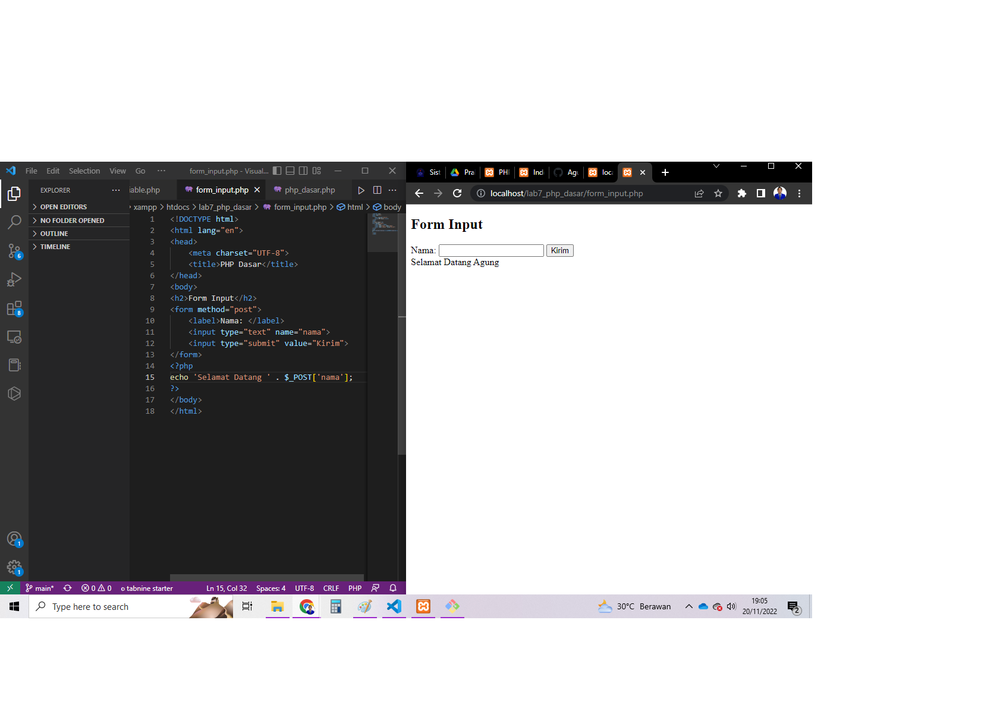
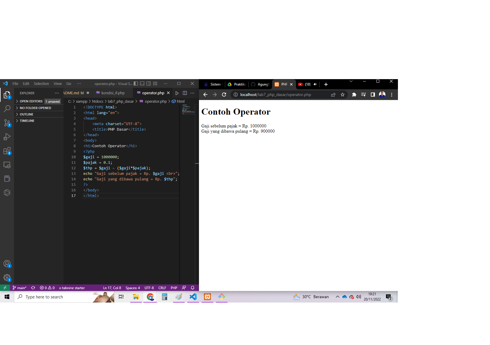
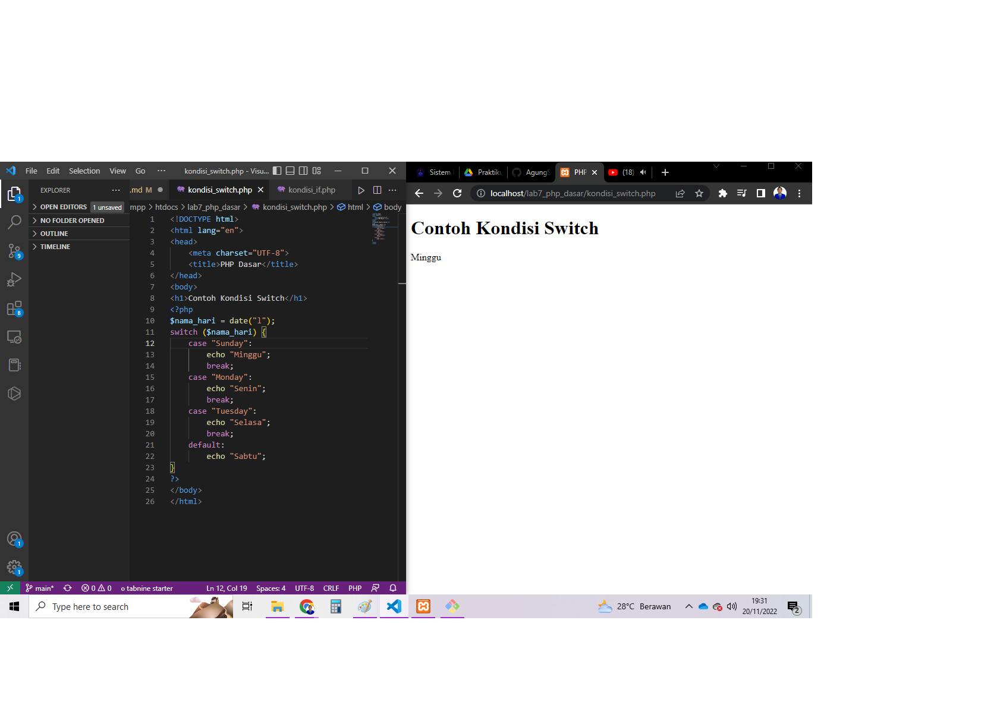
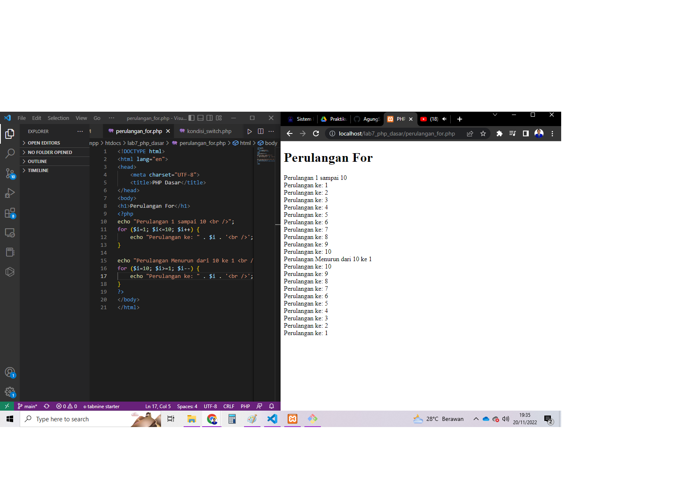
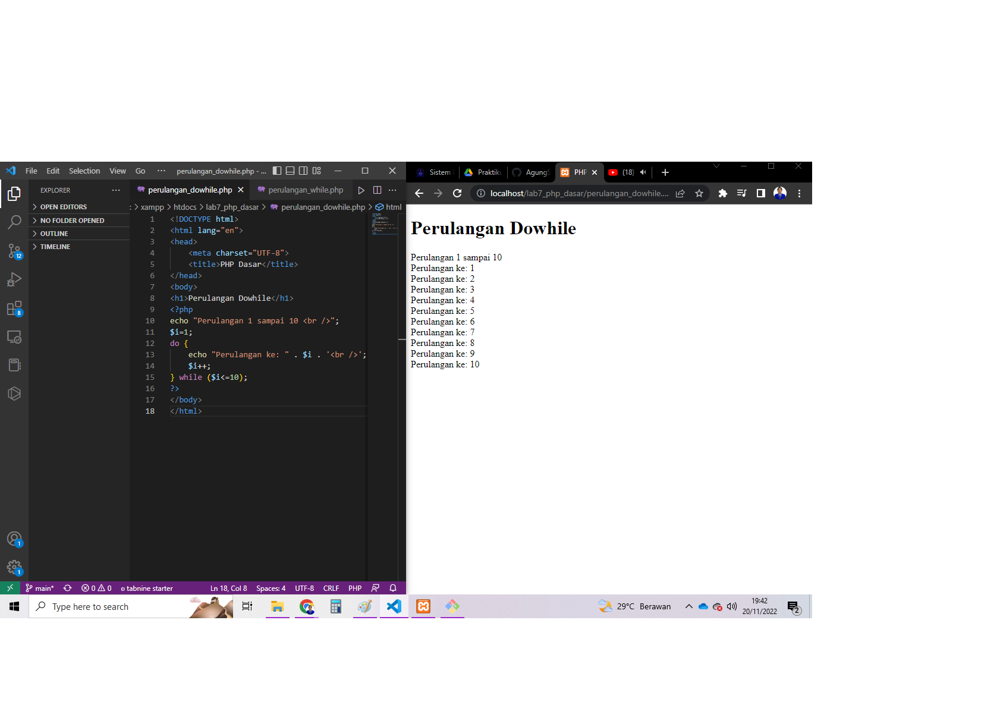

# Lab7Web
### Praktikum 7: PHP Dasar
PHP adalah singkatan dari PHP Hypertext Prepocessor dan merupakan bahasa
pemrograman yang di desain khusus untuk web development atau pengembangan web.
PHP memiliki sifat Server-Side karena PHP dijalankan atau di eksekusi dari sisi server.
maksud di jalankan dari sisi server adalah PHP di jalankan pada komputer server dan
bukan pada komputer client. PHP di jalankan melalui aplikasi web browser sama halnya
seperti HTML. Hampir semua situs-situs besar dan populer di kembangkan menggunakan
PHP. seperti misalnya wordpress, joomla, facebook, twitter, wikipedia dan situs besar
lainnya.
### Menjalankan Web Server
Untuk menjalankan web server dari menu XAMPP Control.
• Uji coba apakah server sudah berkerja dengan baik
http://127.0.0.1 atau http://localhost
Tampil halaman utama XAMPP jika server sudah berkerja dengan baik.
• Dokumen Website
Semua file website tempatkan di direktori: \xampp\htdocs\
• Database MySQL
Direktori: \xampp\mysql\
Manajemen database: http://localhost/phpmyadmin
Dan ini tampilan nya :

### Memulai PHP
Buat folder lab7_php_dasar pada root directory web server (d:\xampp\htdocs)
Kemudian untuk mengakses direktory tersebut pada web server dengan mengakses URL:
http://localhost/lab7_php_dasar/
Dan ini tampilanya :

### PHP Dasar
Buatlah sebuah file baru dengan nama php_dasar.php pada directory tersebut. 
Kemudian buatlah kode seperti berikut.
Kemudian untuk mengakses hasilnya melalui URL:
http://localhost/lab7_php_dasar php_dasar.php
Dan ini hasilnya :

### Variable PHP
Menambahkan variable pada program.

### Predefine Variable $_GET
Lalu masukan kode berikut:
Untuk mengaksesnya menggunakan URL :
http://localhost/lab7_php_dasar/predefine_variable.php?nama=Agung
Dan ini hasilnya :

### Membuat Form Input
Untuk membuat form input masukan kode berikut :
untuk mengaksesnya menggunakan URL :
http://localhost/lab7_php_dasar/form_input.php
Dan ini hasilnya :

### Membuat Operator
Untuk membuat operator masukan kode berikut :
Untuk mengaksesnya menggunakan URL :
http://localhost/lab7_php_dasar/operator.php
Dan ini hasilnya :

### Kondisi IF
Untuk membuat kondisi if masukan kode berikut :
Untuk mengaksesnya menggunakan URL :
http://localhost/lab7_php_dasar/kondisi_if.php
Dan ini hasilnya :

### Kondisi Switch
Untuk membuat kondisi switch masukan kode berikut :
Untuk mengaksesnya menggunakan URL :
http://localhost/lab7_php_dasar/kondisi_switch.php
Dan ini hasilnya :

### Perulangan For
Untuk membuat perulangan for masukan kode berikut :
Untuk mengaksesnya menggunakan URL :
http://localhost/lab7_php_dasar/perulangan_for.php
Dan ini hasilnya :

### Perulangan while
Untuk membuat perulangan while masukan kode berikut :
Untuk mengaksesnya menggunakan URL :
http://localhost/lab7_php_dasar/perulangan_while.php
Dan ini hasilnya :

### Perulangan downhile
Untuk membuat perulangan downhile masukan kode berikut :
Untuk mengaksesnya menggunakan URL :
http://localhost/lab7_php_dasar/perulangan_downhile.php
Dan ini hasilnya :

